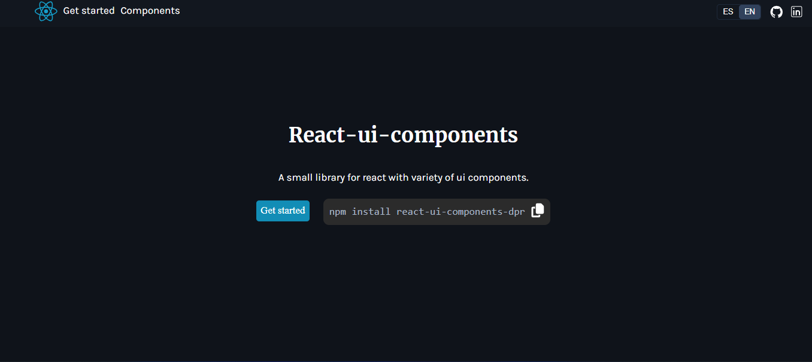

<a name="readme-top"></a>

<br />
<div align="center">
  <a href="https://github.com/DavidPrDev/receptarium1.0">
    
  </a>

  [](https://www.linkedin.com/in/david-pérez-romero-b8a57a292/)

  <h3 align="center">React-ui-components-dpr</h3>
<p align="center">
    
   
</p>
</div>
<ul>
      <li><a href="https://react-ui-components.david-pr.com/">Visita la web </a></li>
    <li><a href="https://react-ui-components.david-pr.com/doc">Visita la documentacion de storybook </a></li>
</ul>
<details>
  <summary>Contenido de la aplicación</summary>
  <ol>
    <li>
      <a href="#Sobre el proyecto">Sobre el proyecto</a>
      <ul>
        <li><a href="#Tecnologías empleadas">Tecnologías</a></li>
      </ul>
    </li>
    <li>
      <a href="#Empezando">Empezando</a>
      <ul>
        <li><a href="#Instalación"> Instalación </a></li>
        <li><a href="#Configuración"> Configuración</a></li>
        <li><a href="#Publicar npm"> Publicar npm</a></li>
      </ul>
    </li>
  </ol>
</details>


<!-- ABOUT THE PROJECT -->
## Sobre el proyecto 


React-ui-components-dpr es una pequeña libreria npm para react empaquetada con webpack.

<p align="right">(<a href="#readme-top">Volver al incio</a>)</p>


### Tecnologías empleadas

Este proyecto está construido con react haciendo uso de webpack para empaquetar la aplicación y así poderla publicar como librería npm online.


* 


* 

<p align="right">(<a href="#readme-top">Volver al incio</a>)</p>


## Empezando

Este readme se centrará en explicar como crear nuestra librería npm con webpack y publicarla.


### Instalación

Para instalar las dependencias necesaria seguiremos este orden :

1. Iniciaremos npm:

   ```sh
    npm init
   ```
2. Instalaremos react y react-dom:

   ```sh
    npm i react
    npm i react-dom
   ```
3. Añadiremos las dependecias de webpack  y babel:

   ```sh
   npm i webpack webpack-cli @babel/core @babel/preset-env @babel/preset-react babel-loader --save -dev
   ```
4. Para generar la build necesitaremos un cargador de css :

   ```sh
   npm i style-loader css-loader --save -dev
   ```
5. Para incluir imágenes en la build necesitaremos un cargador  de ficheros:

    ```sh
    npm i file-loader --save -dev
    ```

<p align="right">(<a href="#readme-top">Volver al incio</a>)</p>

## Configuración

Crearemos un archivo webpack.config.js donde definiremos el entry point de nuestra libreria y los modulos para file-loader y css-loader


   ```sh
   const path = require('path');
  const TerserPlugin = require('terser-webpack-plugin');
  const CssMinimizerPlugin = require("css-minimizer-webpack-plugin");

    module.exports = {
      mode: 'development',
      entry: './index.js',
      output: {
        path: path.resolve(__dirname, 'dist'),
        filename: 'bundle.js',
      },
      optimization: {
        minimize: true,
        minimizer: [
          new TerserPlugin(),
          new CssMinimizerPlugin(),
        ],
      },
      module: {
        rules: [
          {
            test: /\.(js|jsx)$/,
            exclude: /node_modules/,
            use: {
              loader: 'babel-loader',
            },
          },
          {
            test: /\.(png|jpg|jpeg|gif|svg)$/,
            use: [
              {
                loader: 'file-loader',
                options: {
                  name: '[name].[ext]',
                  outputPath: 'images/',
                },
              },
            ],
          },
          {
            test: /\.s?css$/,
            use: ["style-loader", "css-loader"],
          },
        ],
      },
    };

   ```
En index.js exportaremos nuestros componentes de esta manera:

   ```sh
    export { default as Modal } from './src/components/Modal/Modal.jsx';
   ```


<p align="right">(<a href="#readme-top">Volver al incio</a>)</p>


## Publicar npm
Para compilar nuestra librería haremos uso del comando :

   ```sh
    npx webpack
   ```

Para publicar nuestra librería necesitaremos una cuenta en npm , cuando la tengamos creada podremos loguearnos desde la terminal de nuestro proyecto de la siguiente manera:

```sh
    npm login
```

Cuando tengamos nuestra librerìa lista podremos publicarla:

```sh
   npm publish --access public
```
<a href="https://api-receptarium.david-pr.com/api/documentation">Visita la documentacion de swagger </a>


<p align="right">(<a href="#readme-top">Volver al incio</a>)</p>


